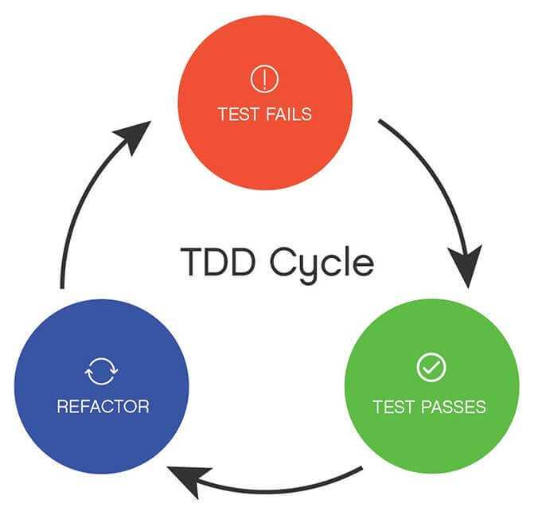

<!-- note
Test-driven development is the practice of developing software by first writing tests

and then producing the minimum amount of code required to pass those tests.

That statement pretty much captures it: you write clear requirements then you write enough code to meet them,

and nothing more. TDD encourages other good practices,

like writing functional code whenever possible and using dependency injection,

because these practices make your code easier to test.

They also have the added benefit of making your code more reusable,

while tests will make future refactors significantly less daunting.

credit: https://chromatichq.com/blog/principles-testdriven-development
😍
-->

import { Card } from '@fusuma/client';

<Card
  left={}
  right={
    <>
      <h3>Small steps</h3>
      <ul>
        <li>Write a small test for a small amount of desired behaviour</li>
        <li>Check the test fails with a clear error (red)</li>
        <li>Write the minimal amount of code to make the test pass (green)</li>
        <li>Refactor</li>
        <li>Repeat</li>
      </ul>
    </>
  }
/>

<footer class="footer-credit">
  

    <a href="https://kentcdodds.com/blog/the-time-i-messed-up">
      Credit: Kent C. Dodds
    </a>
  

  

    <a href ="https://dev.to/quii/why-tdd-1025">
      Credit: Chris James
    </a>
  

</footer>